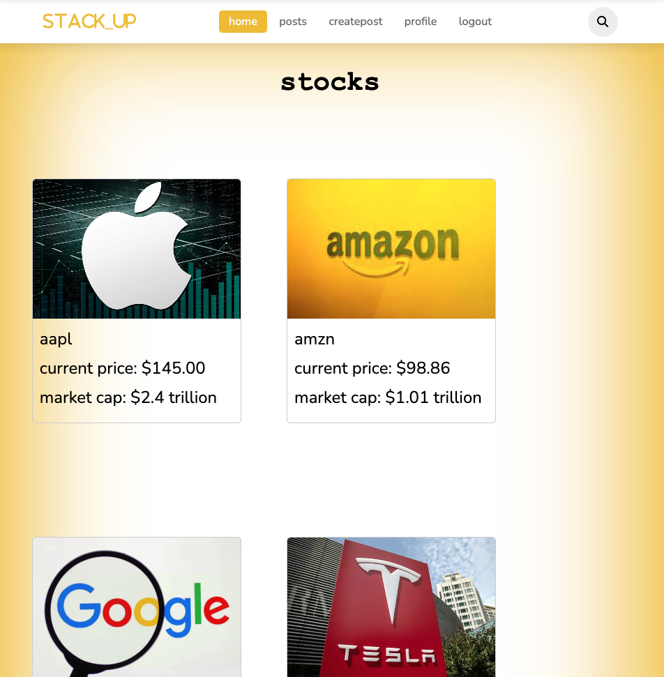
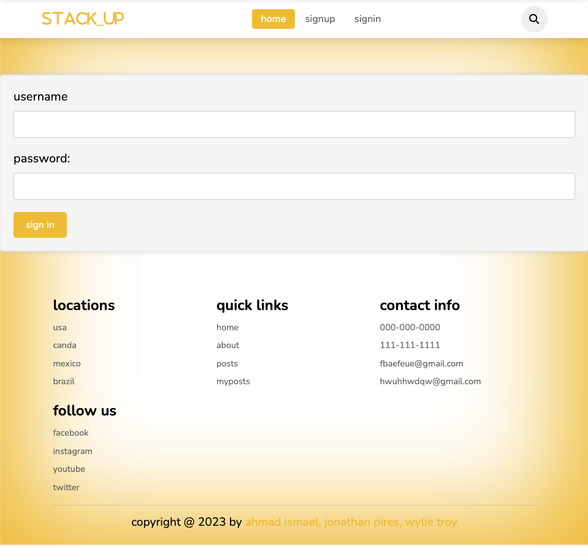
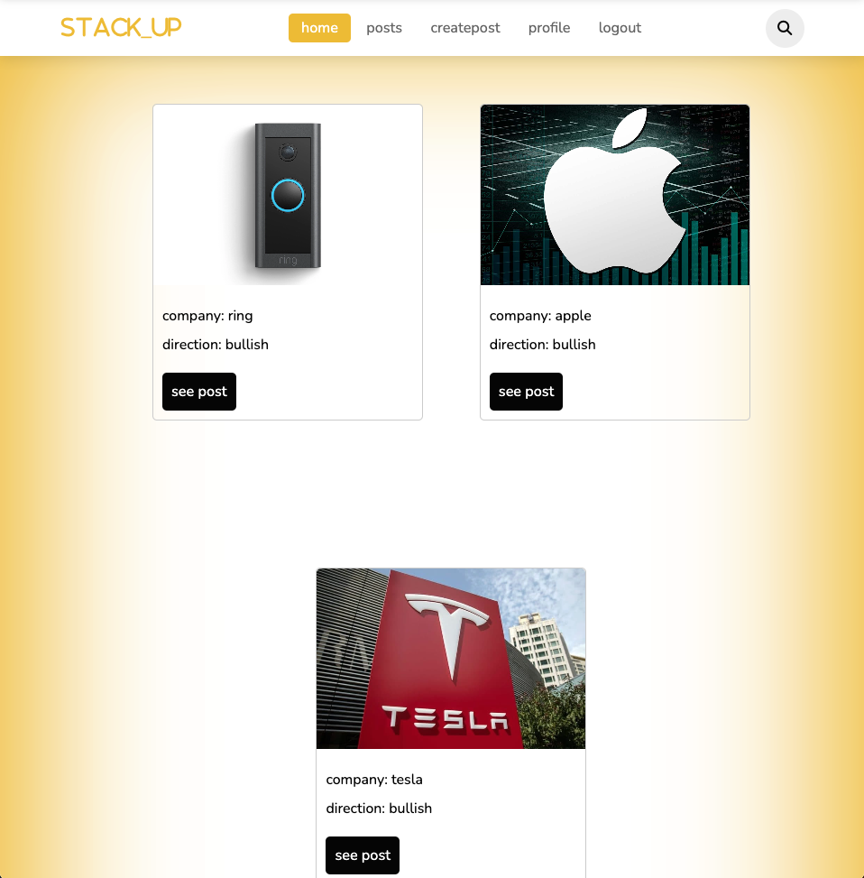
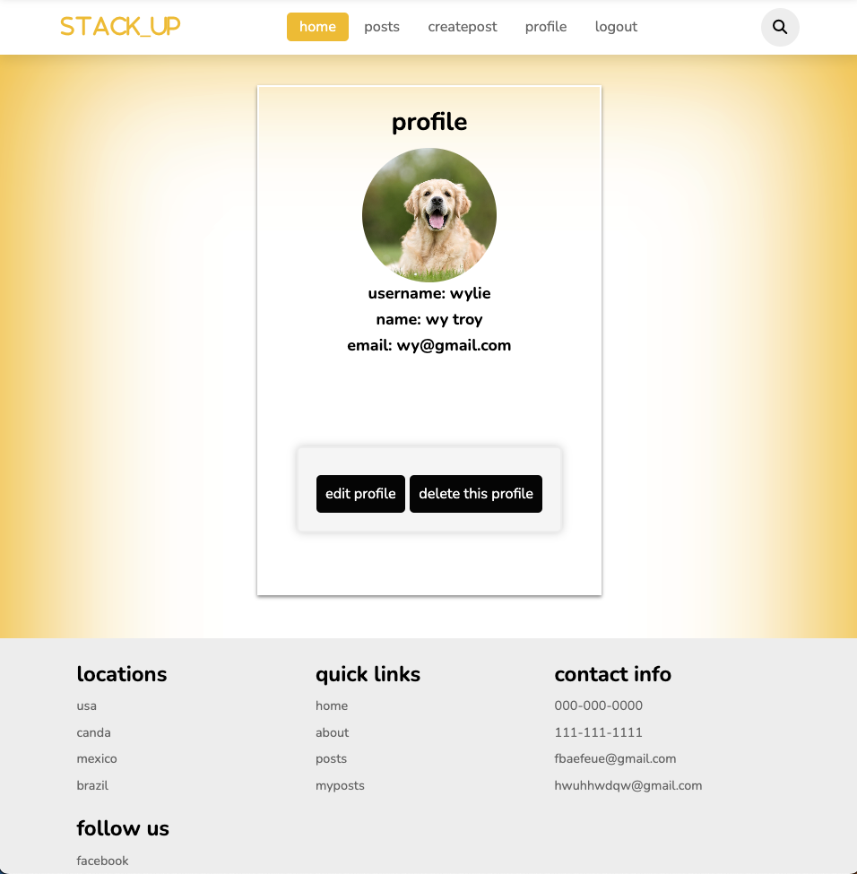

# Stack_UP

In this project we have reverse engineered a stock website where you are able to post your thoughts on a company. When posting it will ask you what industry it is in, the direction being either bullish or bearish, your prediction, and any additional comments you'd like to add for other to be able to read.

We decided to take on this project as we found it to present more of a challenge for us to tackle then if we were to target a more generic website. The biggest challenges we found were the start of the entire project as we were figuring out how we wanted the website to present itself, as we went through with the building we found issues with how it would all connect and making the nav bar work in the smoothest way possible for any user using the website to be able to navagate through with ease.

- As a user I want to be able see what stocks other people are buying and what they're saying about it
- I want to be able to place coments to specific stocks (i.e ask questions about a certain prediction)
- I want to be able to post my own predictions to the site
- I want to be able to find predictions base on industry
- In order to be able to use the site, I will have to sign up or sign in
- I want to be able to comment on others posts

This is the home page that will show stocks.

This is the sign in page that you will need to sign into before browsing the website.

This is the post page where you can see your own and others posts.

This is the profile page that you will be able to see your profile, edit your profile, or delete it.

                How to use the Website?

1. If you do not have an account use the "sign up" button
2. Once you have an account you can login to the website by clicking on the "login" button in the top right corner of the website.
3. Once you are logged in you can click on the "profile" button to view your own profile to either edit your profile or to delete it.
4. You can then click on the "createpost" button to create a prediction about a specific company/stock
5. You can then click on the "posts" button to view your stock predictions that you have posted.
6. Enjoy giving your predictions or comments on others predictions!

Technology Used:
- Server with express.js
- Database with mongoDB
- Mongoose to structure our data
- Created controllers and Schemas for our data bases
- We used ejs to determine how we styled and structured our website
- Node.js for server side development
- Bcript to encript users passwords
- Implimented crud to the API
- Used css to create a mobile friendly website

Future Editions:
- Be able to communicate between users
- Be able to follow users
- Be able to link external api with trending stocks
- Be able to see all of specific users posts
- Create a time out if user is inactive for a specific amount of time during their session or if their tab is closed
- Be able to edit comments created by their own user

                        Credits
Team members for this project

Jonathan Pires
Github: https://github.com/JONPIRES

Ahmad Ismael
Github: https://github.com/ahmadkismael

Wylie Troy
Github: https://github.com/wylietroy